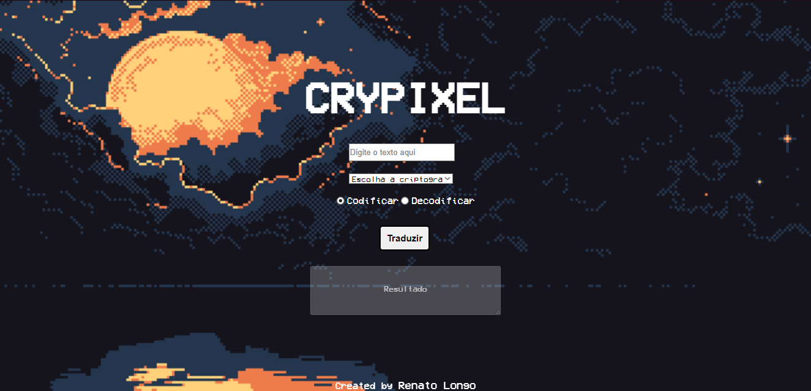

<h1 align= 'center'>CryPixel
</h1>
<h5 align = 'center'>Site de criptografia para Cifra de Cesar e Base64.</h5>

<p align = 'center'>


</p>  
 
<div align = 'center'></div>


# Ferramentas ⚙️
* Javascript
* HTML
* CSS

# Como rodar 🖥️

```bash
//clone esse repositório
$git clone https://github.com/AzzyPog/Cripixel.git

```


